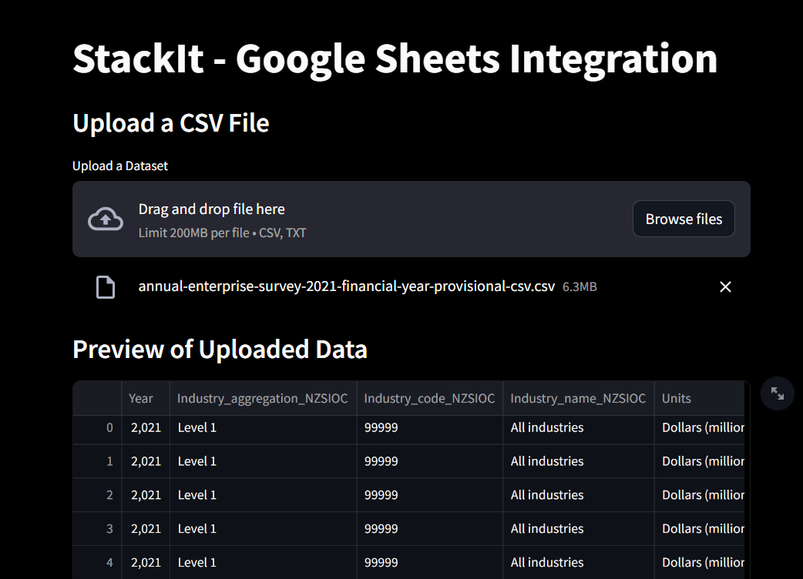
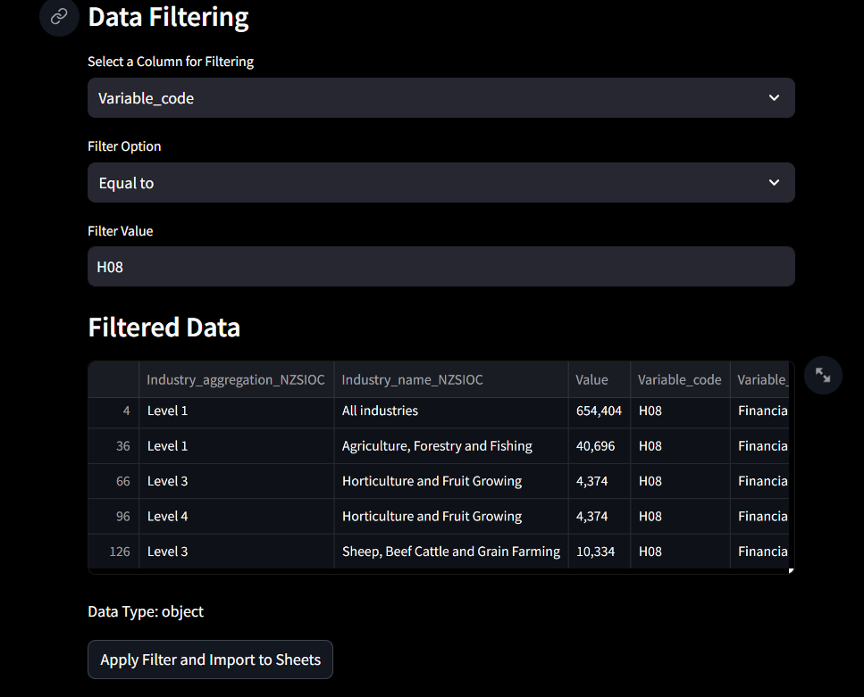

[](https://classroom.github.com/a/_IojtdoU)
# StackIt Hiring Assignment 🚀


# StackIt - Google Sheets Integration

StackIt is a Streamlit app that allows you to upload a CSV file, perform data filtering, and send the filtered data to a Google Sheets spreadsheet. This integration is designed to streamline your data analysis and reporting workflow.

## Getting Started

To get started with StackIt Assignment, follow these steps:

### Prerequisites

Before using the app, make sure you have the following:

- [Python] installed on your system.
- Google account credentials with access to Google Sheets api.

### Installation

1. Clone this repository to your local machine:

   ```bash
   git clone https://github.com/StackItHQ/stackit-hiring-assignment-Rahulrayudu.git
   cd stackit-hiring-assignment-Rahulrayudu
   ```

2. Install the required Python packages using pip:
   
   ```bash
   pip install -r requirements.txt
   ```

3. Main code Directory:<br/>
    * **api/import_csv.py**

### Usage
  - Run the StackIt app by executing the following command:
  - run the api/import_csv.py file
    ```bash 
    streamlit run filepath.py 
    ```
  - The app will open in your web browser. You can now use it to upload a CSV file and perform data analysis.
  - Upload a dataset by clicking the "Upload a Dataset" button and selecting a CSV file from your local machine.
  - Select the columns you want to analyze by using the "Select Columns" multiselect feature.
  - Choose a column for data filtering and apply your desired filter criteria.
  - Click the "Apply Filter" button to send the filtered data to a Google Sheets spreadsheet.
  - Check your Google Sheets account to find the filtered data saved in the specified spreadsheet.

## Deployed on Streamlit
 - https://importcsvtoappsheets-ftfz63bkt8m8qvrzka5ayw.streamlit.app/
 - Please Vist the deployed page 
  

## Checklist
- [✔] My code's working just fine! 🥳
- [✔] I have recorded a video showing it working and embedded it in the README ▶️
- [✔] I have tested all the normal working cases 😎
- [✔] I have even solved some edge cases 💪
- [✔] I added my very planned-out approach to the problem at the end of this README 📜

## planned-out approach
 - **Google Sheets API Setup:** We need to create the Sheets API and use Create_Service function to create Google Sheets service instance. Get the required API credentials as client_secret JSON file. So, no need to expose the Key 
 - **Imports and Constants:** code starts by importing necessary libraries and defining some constants such as file paths, Google API credentials, and the target Google Sheets spreadsheet ID
 - **Using Streamlit:** a open source framework for make the web application
 - **File Upload:** Giving drag and drop option for user to upload the csv file
 - **Size Constraints:** he uploaded file is read into a Pandas DataFrame (df).
 - **Column Selection:** Users can select columns from the DataFrame they want to work with using the st.multiselect widget.
 - **Data Filtering:** Based on the user's selections, the code filters the DataFrame and displays the filtered data in a Streamlit DataFrame
 - **Data Import to Google Sheets:** send the filtered data to a Google Sheets spreadsheet
## Developer's Section
- https://drive.google.com/file/d/1thGEfHq4thCFOC6m8yH0L3sHYAXQea_m/view?usp=sharing
- The working video is in this directory (working_video/working_Stackit.mp4)
- Main code Directory (api/import_csv.py)
 [](./working_video/working_Stackit.mp4)

